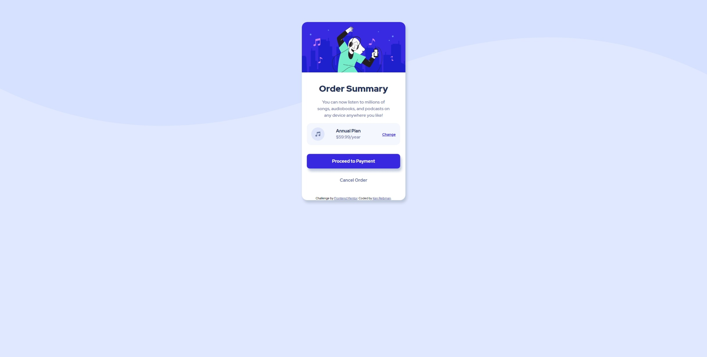

# Frontend Mentor - Order summary card solution

This is a solution to the [Order summary card challenge on Frontend Mentor](https://www.frontendmentor.io/challenges/order-summary-component-QlPmajDUj). Frontend Mentor challenges help you improve your coding skills by building realistic projects. 

## Table of contents

- [Overview](#overview)
  - [The challenge](#the-challenge)
  - [Screenshot](#screenshot)
  - [Links](#links)
- [My process](#my-process)
  - [Built with](#built-with)
  - [What I learned](#what-i-learned)
  - [Continued development](#continued-development)
  - [Useful resources](#useful-resources)
- [Author](#author)
- [Acknowledgments](#acknowledgments)


## Overview

### The challenge

Users should be able to:

- See hover states for interactive elements

### Screenshot



### Links

- Solution URL: [Add solution URL here](https://your-solution-url.com)
- Live Site URL: [Add live site URL here](https://your-live-site-url.com)

## My process

### Built with
- Flexbox


### What I learned

Still learning - I was able to use Flexbox and make the site responsive as well. Still have a long way to go but this is a start!
ALSO learned a little bit of media queries...

To see how you can add code snippets, see below:

```html

```
```css

.plan {
    align-items: center;
    margin: 1rem auto;
    background-color: var(--very-pale-blue);
    width: 90%;
    display: flex;
    padding: 1em;
    border-radius: 1rem;
}

.icon-music {
    flex: 1;
}

.icon-music img {
    display: block;
}

.price {
    flex: 4;
    text-align: center;
}

.change {
    flex: 2;
    text-align: right;
}

@media (min-width: 1440px) {
    body {
        background: url("../images/pattern-background-desktop.svg") no-repeat center -350px/cover;
        background-color: var(--pale-blue);
    }

}
}
```
```js

```

### Continued development

Use this section to outline areas that you want to continue focusing on in future projects. These could be concepts you're still not completely comfortable with or techniques you found useful that you want to refine and perfect.

I need to focus more on making the page responsive. 
Definitely need to learn how to use Grid.
Maybe some frameworks as well.
LASTLY, media queries!

### Useful resources

- Google and Youtube -- Also call up some friends who know web development, they might know a thing or two that can help.

## Author

- Website - [Ken Reibman](https:www.instagram.com/kenreeb)
- Frontend Mentor - [@lmaoken](https://www.frontendmentor.io/profile/lmaoken)


## Acknowledgments

Thanks Devin : https://www.instagram.com/devinobrien/


